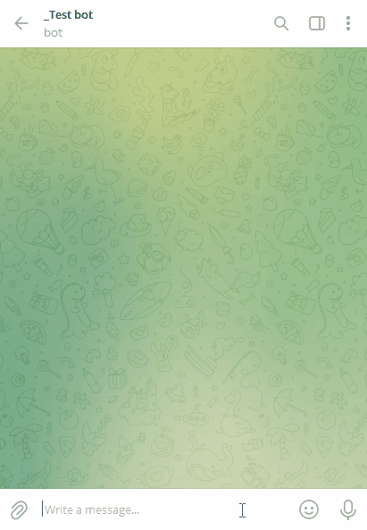
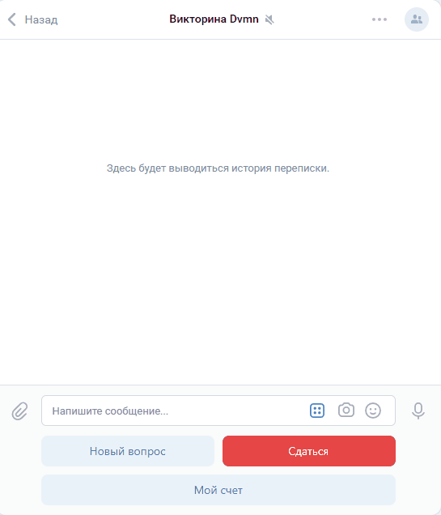

# Интеграция чат-ботов telegram и vk с сервисами Google Dialogflow

Приложение предназначено для ведения диалога с пользователями с помощью чат-ботов telegram и vk. Ответы формируются службами Google Dialogflow

##Ссылки на примеры работающих ботов:
[чат telegram](https://t.me/dims_dvmn_test_bot)



[группа vk](https://vk.com/public221843594)



### Как установить

Скачайте код:
```sh
git clone https://github.com/dimsonnGH/Bot-recognition
```
Для работы необходим Python 3 версии. Если он у вас еще не установлен, [Установите отсюда](https://www.python.org/).

Проверьте, что `python` установлен и корректно настроен. Запустите его в командной строке:
```sh
python --version
```
Рекомендуется запускать приложение в виртуальном окружении. Чтобы его создать, выполните в каталоге проекта:
```sh
python -m venv venv
```
Активируйте его. На разных операционных системах это делается разными командами:
- Windows: `.\venv\Scripts\activate`
- MacOS/Linux: `source venv/bin/activate`


Установите зависимости в виртуальное окружение:
```sh
pip install -r requirements.txt
```

### Настройка telegram-бота

Зарегистрируйте бота в Telegram. Для этого напишите [Отцу ботов](https://telegram.me/BotFather) команду `\start`, а затем `\newbot`. Отец ботов вернет токен доступа к API Telegram.

[Установите Redis](https://redis.io/docs/getting-started/installation/)

[Скачайте архив с вопросами](https://dvmn.org/media/modules_dist/quiz-questions.zip) и распакуйте его. Бот загружает вопросы из папки, указанной в настройке `QUESTIONS_FOLDER_NAME` в файле `.env`. Если настройка не задана, то загружает из папки `questions` в текущем каталоге.

Создайте файл `.env` в каталоге проекта со следующими настройками:

```
DVNM_BOT_TELEGRAM_TOKEN=<токен доступа к API Telegram>
REDIS_HOST=<Имя сервера Redis, если Redis запущен на одном сервере с ботом, то 127.0.0.1>
REDIS_PORT=<порт Redis, по умолчанию 6379>
QUESTIONS_FOLDER_NAME=<путь к папке с вопросами>
```

### Запуск telegram-бота

Запустите telegram-бота 
```sh
python telegram_bot.py 
```
Проверьте работу telegram-бота.

### Настройка vk-бота
Создайте группу Вконтакте.

Разрешите боту отправлять сообщения от имени группы  

Получите [API токен группы](https://vk.com/dev/bots_docs).

Добавьте в файл `.env` в каталоге проекта со следующую настройку:
```VK_API_KEY=<API токен группы vk>```

### Запуск vk-бота

Запустите vk-бота 
```sh
python vk_bot.py 
```
Проверьте работу vk-бота, отправив сообщение в группу vk.

### Цель проекта

Код написан в образовательных целях на онлайн-курсе для веб-разработчиков [dvmn.org](https://dvmn.org/).